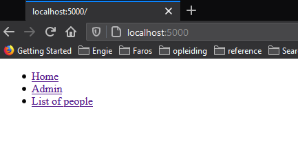
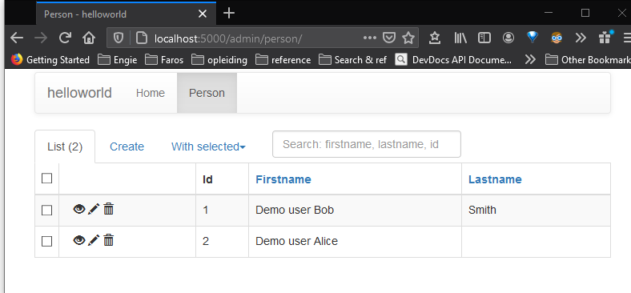

# Quick Start Guide

## How to launch the web application

The web application is deployable with a docker-compose.yml file, and that is 
the easiest way to launch it.

Steps to launch the web application with docker-compose:

### Step 1: Change directory to the root of the project (i.e. this git repository) 

### Step 2: Make sure git did not convert the End-of-Line characters of the DB initialisation script

Check that the following database initialization script for the PostgreSQL container is effectively using Linux/Unix End-of-Line characters, not the Windows EOL

Windows uses two characters for the end of a line: a newline plus a carriage return. But the windows EOL may cause this script to fail.

Git may convert Linux EOLs into Windows EOLs automatically when you pull and push from GitHub, if you have configured Git that way.

So check this script, and if is is using Windows End-of-Lines, convert the EOL to Linux and save it.

`demo-for-engie\scripts\postgres\1-init-user-db.sh`

> **TO DO: things to improve:**
> 
> - TODO: 1) Change my git to not cause this problem anymore.
> - TODO: 2) Consider adding a sed script to remove the carriage return characters if this has happened.

### Step 3: Run docker-compose up

```bash
docker-compose up
```

In the output of `docker-compose up ` you should see some output about the postgres database and tables being created, similar to this;

Note in particular the line for the initialization script:

`/usr/local/bin/docker-entrypoint.sh: running /docker-entrypoint-initdb.d/1-init-user-db.sh`

Expected output of `docker-compose up ` :

```

... stuff before the important bit

/usr/local/bin/docker-entrypoint.sh: running /docker-entrypoint-initdb.d/1-init-user-db.sh
postgres_1  | CREATE ROLE
postgres_1  | CREATE DATABASE
postgres_1  | GRANT
postgres_1  | SET
postgres_1  | SET
postgres_1  | SET
postgres_1  | SET
postgres_1  | SET
postgres_1  |  set_config
postgres_1  | ------------
postgres_1  |
postgres_1  | (1 row)
postgres_1  |
postgres_1  | SET
postgres_1  | SET
postgres_1  | SET
postgres_1  | SET
postgres_1  | SET
postgres_1  | SET
postgres_1  | CREATE TABLE
postgres_1  | CREATE SEQUENCE
postgres_1  | ALTER SEQUENCE
postgres_1  | ALTER TABLE
postgres_1  | ALTER TABLE
web_1       |  * Debugger is active!
web_1       |  * Debugger PIN: 325-509-346
postgres_1  | SET
postgres_1  | SET
postgres_1  | SET
postgres_1  | SET
postgres_1  | SET
postgres_1  |  set_config
postgres_1  | ------------
postgres_1  |
postgres_1  | (1 row)
postgres_1  |
postgres_1  | SET
postgres_1  | SET
postgres_1  | SET
postgres_1  | SET
postgres_1  | COPY 2
postgres_1  |  setval
postgres_1  | --------
postgres_1  |       2
postgres_1  | (1 row)


... and os on

```

## How to launch the Command Line Application

See:  [Command Line Interface for Hello World](helloworld-cli.md)

## Using the helloworld Web Application

Next, to use the helloworld application, open the following URL in your web browser:

[http://localhost:5000](http://localhost:5000)

### Menu at the Top to Help You Get Around

The helloworld app has a few links at the top of the page, that could be turned into a proper navigation menu, but at present they don't have any CSS style yet to make them look like a menu.



These are the links you will find, and what they are for:

- link to the home page: [http://localhost:5000/](http://localhost:5000/)
- link to the [Admin application](http://localhost:5000/admin/)
- link to a [List of people](http://localhost:5000/listpersons)
  - This is a page that shows the first 10 persons in the database with the link to open the page for their "greeting".

### Admin Application to Create & Manage Persons

The app need to store names linked to an ID in a database. This is is stored in a database table named `person`, in PostgresSQL.

We also needs an admin app to create, edit and delete new persons.
This admin application can be accessed via the item in the menu at the top of
the helloworld app.

If you have the app running, here is the link again: [Admin application](http://localhost:5000/admin/)

The image right below shows what the admin application looks like.

- Note the menu at the top of the page.
- Click on the Person menu on the right to open the GUI for managing persons.



### Demo Persons for Testing

To make it a bit easier to start testing immediately the database initialization
scripts add two demo persons in the database.

This happens automatically when the Postgres container starts the first time,
so you don't have to run any extra commands to get things up and running.

The person objects have the following fields:

- a numerical ID which is a database sequence,
- a `firstname` which is a mandatory column/field,
- an optional `lastname` field, so you can leave this blank if you want.

#### Commands to setup a new database

In case you want to use another database, say you want a simple SQLite setup for some local development test:

I added two commands in the flask CLI to setup the database. But for PostgreSQL this is not needed because the container sets it up already.

- `flask init-db`: Creates the person table
- `flask add-demo-persons`  Add two users to start the demo: Bob and Alice.

For a full explanation how to run these, see the section
`Commands to initialize a database`
of [Command Line Interface for Hello World](helloworld-cli.md) .

## No domain, only on localhost for now

I did not have time to deploy it in the cloud or configre things like DNS or the hostname, the things that would be necessary to redirect to the URL in the assignment, namely: `http://engie-interview.dev` .

At present, that side is not in my current skill set, so I would have to research more how to do that and that takes time.
I currently don't have any knowledge of AWS or other cloud platforms (not yet, at least).

My colleagues pointed me to following procedure with Kubernetes on AWS:

[Deploy Docker Containers](https://aws.amazon.com/getting-started/hands-on/deploy-docker-containers/)

Alternatively, Heroku or Linode might also be relatively simple solutions for an small app like this one.

## Containers: Flask, Postgres and Adminer

We have three containers:

- one for the Flask app
- one for PostgreSQL
- Adminer as a web GUI for postgres

| Container for      | Service name | port | host      |
|--------------------|--------------|------|-----------|
| Flask app          | web          | 5000 | localhost |
| PostgreSQL DB      | postres      | 5324 | localhost |
| Adminer DB Web GUI | adminer      | 8080 | localhost |

The docker-compose.yml could be improved for production, this is really a development setup.

1. The web container is linking the code into the container as a volume to be able to edit the code and see the result without restarting the container.
  
2. `flask run` should not be run as the flask server in production, especially not with FLASK_ENV=development.

    Instead would be better deploy the Flask app with some wsgi technology, Gunicorn might be a good choice.

3. In a real application a reverse proxy may be needed, for load balancing and security. Nginx is a common choice for this.
